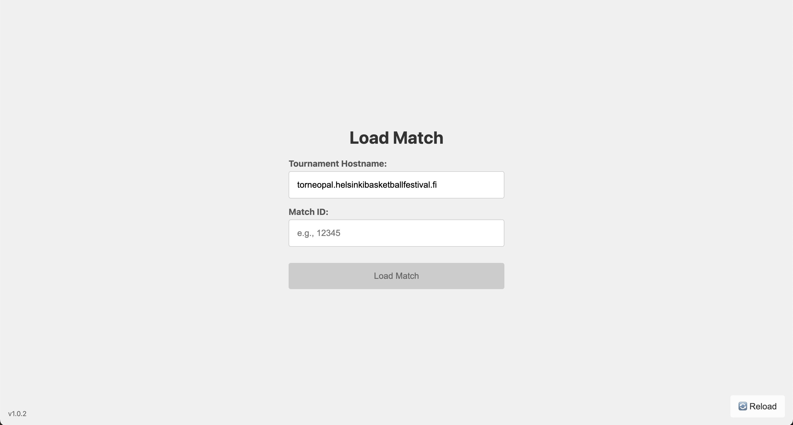
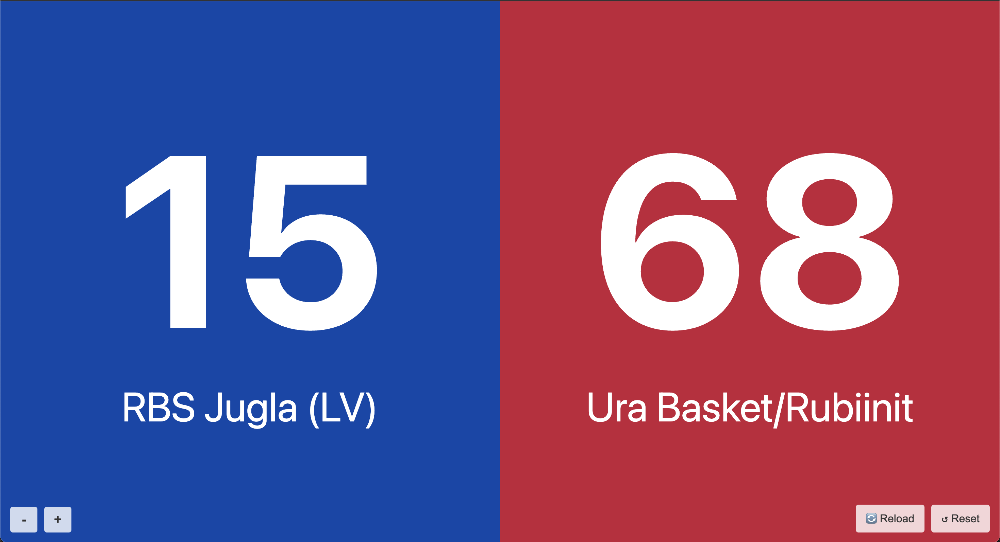

# Basketball Scoreboard Web App

A simple, full-screen web application designed primarily for iPad to display live basketball scores fetched from a specified tournament API.

**Note:** This application is specifically designed to work with the API structure provided by **Torneopal** tournament management systems. It expects the score data to be available at `https://<tournament-hostname>/taso/rest/getScore?match_id=<match_id>`.

## Features

* **Live Score Display:** Shows team names and scores for a selected match.
* **Configurable API Host:** Allows specifying the hostname for the Torneopal tournament API.
* **Auto-Refresh:** Scores update automatically every 5 seconds.
* **Screen Wake Lock:** Prevents the device screen from sleeping while the scoreboard is active.
* **Persistent Hostname:** Remembers the last used tournament hostname for convenience.
* **Full-Screen Capable:** Can be added to the Home Screen on iOS/iPadOS for an app-like experience.

## Screenshots

### Load Match Screen



### Scoreboard Screen



## Usage

1. Open the web app in a browser (optimized for iPad) at `https://scoreboard.yourdomain.com/`.
2. On the **Load Match** screen:

   * **Tournament Hostname:** Enter the tournament’s domain (without `https://` or slashes), for example:

     ```
     torneopal.helsinkibasketballfestival.fi
     ```

     The app will remember this value for next time.
   * **Match ID:** Enter the match ID (e.g., `2051743`). You can find this in the match URL or box score URL on the tournament site, for example:

     ```
     https://extranet.torneopal.fi/taso/ottelukirjaus.php?otteluid=2051743
     ```
   * Click **Load Match**.
3. During the game:

   * The live scores and team names are displayed and auto-update every 5 seconds.
   * Adjust the score font size using the **+** and **−** buttons in the bottom left corner.
   * Use the **↺ Reset** button to return to the Load Match screen and select a new match.
   * Use **Reload** in the bottom right to refresh the app (if needed).

## Deployment

This is a static web application (HTML, CSS, JavaScript). Deploy the contents of the repository (`index.html`, `style.css`, `script.js`, `manifest.json`, and the `icons/` directory) to any static web hosting service (e.g., AWS S3/CloudFront, Netlify, Vercel, GitHub Pages).
